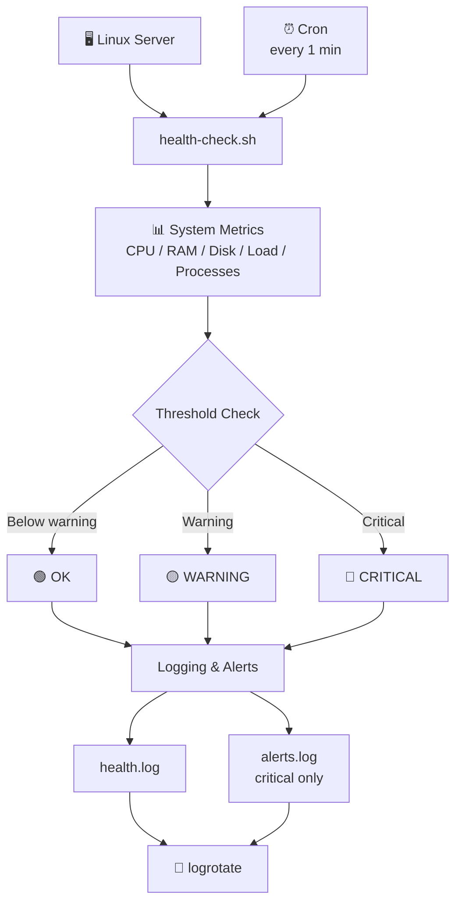

<h1 align="center">🖥️ Linux Server Health Monitor</h1>

<p align="center">
  A lightweight Bash tool that monitors Linux server health, with threshold alerts, logging, cron automation, and log rotation.
</p>

<p align="center">
  
  
  
  
  
</p>

<p align="center">
  
</p>

---

## 📑 Table of Contents

- [Overview](#-overview)
- [Features](#-features)
- [Technologies Used](#️-technologies-used)
- [Architecture](#️-architecture)
- [Thresholds](#️-thresholds)
- [Exit Codes](#-exit-codes)
- [Installation](#-installation)
- [Usage](#️-usage)
- [Cron Automation](#-cron-automation)
- [Logs](#-logs)
- [Log Rotation](#-log-rotation)
- [Alert Testing](#-alert-testing)
- [Project Structure](#-project-structure)
- [Learning Outcomes](#-learning-outcomes)
- [Author](#-author)

---

## 📌 Overview

This project monitors core Linux system resources: **CPU**, **memory**, **disk usage**, **load average**, and **running processes**.

It supports threshold-based warnings, alert logging, cron automation, and log rotation. Its exit codes make it easy to plug into other automation or monitoring systems.

## 🚀 Features

- ✅ CPU, memory, and disk usage monitoring
- ✅ Load average and process count monitoring
- ✅ Top CPU-consuming processes
- ✅ Warning and Critical thresholds
- ✅ Automatic health status detection
- ✅ Health logging and critical alert logging
- ✅ Cron automation (every minute)
- ✅ Log rotation with `logrotate`
- ✅ One-command setup (`setup.sh`) and alert demo (`test-alert.sh`)

## 🛠️ Technologies Used

| Category | Tools |
|----------|-------|
| **OS & Scripting** | Linux, Bash, Shell scripting |
| **Scheduling & Services** | Cron, systemd |
| **Log Management** | logrotate |
| **System Data Sources** | `/proc`, `ps`, `free`, `df` |
| **Text Processing** | `awk`, `sed` |

## 🏗️ Architecture

Cron runs the health-check script every minute. The script collects system metrics, compares them against thresholds, and writes the results to log files.



## ⚙️ Thresholds

| Resource | ⚠️ Warning | 🔴 Critical |
|----------|:---------:|:-----------:|
| CPU      | 80%       | 90%         |
| Memory   | 80%       | 90%         |
| Disk     | 80%       | 90%         |

## 🔢 Exit Codes

| Code | Status |
|:----:|--------|
| `0`  | 🟢 Healthy |
| `1`  | 🟡 Warning |
| `2`  | 🔴 Critical |

This makes the script useful for automation and monitoring systems.

## 📦 Installation

One command installs everything:

```bash
git clone https://github.com/<your-username>/linux-health-monitor.git
cd linux-health-monitor
sudo ./setup.sh
```

`setup.sh` will:

1. Copy `health-check.sh` to `/opt/linux-health-monitor/`
2. Create the log directory and log files in `/var/log/linux-health-monitor/`
3. Install the logrotate configuration to `/etc/logrotate.d/`
4. Add a cron job that runs the health check every minute
5. Verify the setup

It is safe to run more than once, because the cron entry is replaced rather than duplicated.

## ▶️ Usage

Run it manually:

```bash
sudo /opt/linux-health-monitor/health-check.sh
```

The script prints a live report of CPU, memory, disk, load average, process count, the top CPU-consuming processes, and the overall system status.


## ⏰ Cron Automation

The health check runs automatically every minute:

```cron
* * * * * /opt/linux-health-monitor/health-check.sh >/dev/null 2>&1
```


## 📋 Logs

| Log File | Contents |
|----------|----------|
| `/var/log/linux-health-monitor/health.log` | Result of every health check |
| `/var/log/linux-health-monitor/alerts.log` | Critical alerts only |


## 🔄 Log Rotation

`logrotate` is configured to:

- Rotate logs **daily**
- Keep **7** rotated logs
- **Compress** old logs
- Prevent logs from growing indefinitely

Config file: [`config/linux-health-monitor.logrotate`](config/linux-health-monitor.logrotate), installed automatically by `setup.sh`.

Test it manually:

```bash
sudo logrotate -f /etc/logrotate.d/linux-health-monitor
```


## 🚨 Alert Testing

Run the demo script to see the alert system work without waiting for a real incident:

```bash
./test-alert.sh
```

It runs a temporary copy of `health-check.sh` with very low thresholds, prints the result and the exit code, and shows the generated alert log. It writes to a temporary directory, so your real logs are not modified.

The screenshot below comes from testing on a real server: thresholds were temporarily lowered, and the CPU was stressed to reach `CRITICAL`. Production thresholds were restored afterward.


## 📁 Project Structure

```text
linux-health-monitor/
├── README.md
├── LICENSE
├── .gitignore
├── health-check.sh        # main monitoring script
├── setup.sh               # installation and automation
├── test-alert.sh          # alert demonstration
├── config/
│   └── linux-health-monitor.logrotate
└── screenshots/
    ├── health-check-healthy.png
    ├── alert-critical.png
    ├── cron-automation.png
    ├── logrotate.png
    └── logs.png
```

## 🎯 Learning Outcomes

- Linux system monitoring
- Bash scripting and working with `/proc`
- Process management
- Conditional logic and exit codes
- Cron jobs
- Logging and log rotation
- Basic Linux automation

## 👨‍💻 Author

**Aditya Muley**

---
